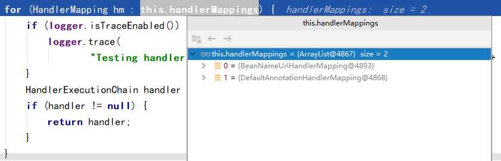

# 第一章 初识SpringMVC 

## 1.1 SpringMVC 简介

- Spring 操作 Web 模块，简化 Web 开发
  


SpringMVC == Spring中 的 Web 模块

- Spring 为 展现层 提供的基于 MVC 设计理念的 Web 框架
  

  回顾MVC

- 可以通过 MVC 注解，使 POJO 称为处理请求的控制器，而无需实现任何借口

  - POJO：一个普通的 Java 类

- 支持 REST 风格的 URL 请求

- 采用了松散耦合的可插拔组件结构，具有扩展性和灵活性

## 1.2 SpringMVC 的 MVC 思想


## 1.3 HelloWorld

1. 在 IDEA 中创建 Maven WEB 工程

2. 导入所需依赖(核心容器模块 + web 模块)

   ```xml
   <!-- Spring 核心容器 -->
   <dependency>
       <groupId>org.springframework</groupId>
       <artifactId>spring-context</artifactId>
       <version>${spring.version}</version>
   </dependency>
   <!-- Spring Web模块 -->
   <!-- web组件 -->
   <dependency>
       <groupId>org.springframework</groupId>
       <artifactId>spring-web</artifactId>
       <version>${spring.version}</version>
   </dependency>
   <!-- WebMVC 组件 -->
   <dependency>
       <groupId>org.springframework</groupId>
       <artifactId>spring-webmvc</artifactId>
       <version>${spring.version}</version>
   </dependency>
   ```

3. 在 web.xml 中配置前端控制器

   ```xml
   <!-- SpringMvc需要一个前端控制器负责拦截请求，并智能派发
           这个前端控制器本质上就是一个 Servlet ，所以需要在 web.xml 下配置
      -->
   <servlet>
   	<servlet-name>springDispatcherServlet</servlet-name>
       <servlet-class>org.springframework.web.servlet.DispatcherServlet</servlet-class>
       <init-param>
           <!-- SpringMVC (Spring) 配置文件的位置 -->
           <param-name>contextConfigLocation</param-name>
           <param-value>classpath:Application/SpringMVC.xml</param-value>
       </init-param>
       <!--
        load-on-startup:可以使对应的 Servlet 程序在Tomcat服务器启动后就创建对象，而不是第一次访问时再创建
                        对应的参数越小，优先级越高，越先创建对象
        -->
       <load-on-startup>1</load-on-startup>
   </servlet>
   <servlet-mapping>
       <servlet-name>springDispatcherServlet</servlet-name>
       <!--
       / 和 /* 的区别
         /  : 能拦截除了 jsp 文件之外的请求，保证jsp可以正确访问
         /* : 能拦截所有请求，包括 jsp 文件
       -->
       <url-pattern>/</url-pattern>
   </servlet-mapping>
   ```

4. 在 SpringMVC.xml 中开启 **组件**扫描

5. 创建两个基本的 jsp 页面
   

6. 创建第一个控制器 MyFirstController.java (一个普通的 Java 类)

   ```java
   @Controller //告诉 SpringMVC 这是一个 控制器组件，可以处理请求
   public class MyFirstController {
   
       /*
       * @RequestMapping：配置接收可以接收的请求地址
       *   / 代表当前工程目录下，映射到 webapp 目录
       * */
       @RequestMapping("/hello")
       public String hello(){
           System.out.println("收到请求，正在处理...");
           return "/WEB-INF/pages/success.jsp";
       }
   
   }
   ```

7. 在 SpringMVC 配置文件中配置视图解析器，简化返回值的地址

   ```xml
   <!-- 配置视图解析器，帮助我们拼接返回页面的地址 -->
   <bean class="org.springframework.web.servlet.view.InternalResourceViewResolver">
       <!-- 配置两个属性,prefix 和 suffix -->
       <property name="prefix" value="/WEB-INF/pages/"></property>
       <property name="suffix" value=".jsp"></property>
   </bean>
   ```

8. 修改源控制器程序代码

   ```java
   /*
   * @RequestMapping：配置接收可以接收的请求地址
   *   / 代表当前工程目录下，映射到 webapp 目录
   * */
   @RequestMapping("/hello")
   public String hello(){
       System.out.println("收到请求，正在处理...");
       //return "/WEB-INF/pages/success.jsp"; //使用视图解析器，简化返回的路径
       /*
       *   <property name="prefix" value="/WEB-INF/pages/"></property>
       <property name="suffix" value=".jsp"></property>
       * 该方法的返回的值，最后会被拼接为 /WEB-INF/pages/success.jsp
       * */
       return "success";
   }
   ```

## 1.4 HelloWorld 中的细节补充

### 1.4.1 运行流程

1. 前端 JSP 页面发送请求，地址为：http://localhost:8080/01_HelloWorld/hello
2. Tomcat 服务器接收请求
3. 将请求**交给 SpringMVC 的前端控制器**进行派发
4. SpringMVC 前端控制器将请求地址和 控制器类的**@RequestMapping注解的值** 进行比较，找到目标控制类以及方法
5. 通过**反射**调用该方法
6. 如果该方法有返回值，SpringMVC 会认为这就是请求**处理后需要转发**的地址
7. 通过 SpringMVC 的配置的视图解析器，**拼接**完整的请求转发地址
8. 有前端控制器完成 **请求转发**

### 1.4.2 @RequestMapping 

> 详情请看第二章

### 1.4.3 不指定配置文件的默认配置文件

- 如果在 web.xml 中不指定配置文件，则需要在 WEB-INF 目录下创建一个
  对应 **前端控制器名(servlet-name)-servlet.xml 的 Spring** 配置文件
  

### 1.4.4 web.xml 中 前端控制器 url-pattern 的设置

1. / 和 /* 的区别
   - / 会拦截除了 jsp 外的请求
   - /* 会拦截所有请求
   - 但二者都会拦截静态资源，后者只因为本身的配置，前者则是覆盖了 Tomcat 的 web.xml 中的配置
2. Tomcat 的 web,xml
   - 所有部署在 Tomcat 的 WEB 项目 中的 web.xml 都继承于 Tomcat 本身配置的 web.xml
   - Tomcat 中使用了 DefaultServlet 来处理除了 jsp 和 Servlet 外的静态资源，对于静态资源，Tomcat 会找到后返回
     
   - 而当前端控制器 Servlet 将 url-pattern 设置为 / 时，则会禁用 DefaultServlet ，导致静态资源无法访问
   - 而对于 JSP ，Tomcat 默认使用的是 JspServlet 拦截该请求，其 url-pattern 的参数值为 *.jsp
     所以并不会被 前端控制器 拦截

# 第二章 @RequestMapping 映射请求

## 2.1 用于方法

- 负责告诉 SpringMVC 该方法接收的请求地址
- /可以不加，默认都是从本项目下开始找
- 一个方法处理一个请求


## 2.2 用于类

- 为当前类所有方法的请求地址前面额外指定一个基准路径

- 是基准路径不是 拼串前缀

  ```java
  @RequestMapping("/emt")
  @Controller
  public class RequestMappingTestController {
  
      @RequestMapping("/haha") //访问该方法的请求路径仍然是 /emt/haha，而不是/emthaha
      public String haha(){
          System.out.println("收到请求，正在处理...");
          return "success";
      }
  
  }
  ```

- 用在类上后，该类中的方法的 
  @RequestMapping 的值 
  可以和别的控制器方法的 @RequestMapping 的
  值一样

- 但访问的真实路径(加上基准路径后的路径)，仍不能相同

  

## 2.3 其他属性

1. method：限定请求方式

   - HTTP中的所有请求方式 【GET】, HEAD,【POST】, PUT, PATCH, DELETE, OPTIONS, TRACE

   - 属性值为 RequestMethod 枚举类的对象值

     ```java
     /*
     * 使用 method 后，代表该方法只接收指定请求方式的请求
     * 可以指定多个，如：{RequestMethod.POST,RequestMethod.GET}
     * */
     @RequestMapping(value = "/method",method = RequestMethod.POST)
     public String method(){
         return "success";
     }
     ```

   

2. params：规定请求参数

   - –param1: 表示请求必须包含名为 param1 的请求参数
         可以为空值("")不能不带

   - –!param1: 表示请求不能包含名为 param1 的请求参数

     ​				   为空值("")也不行，不能带

   - –param1 != value1: 表示请求包含名为 param1 的请求参数，但其值不能为 value1

     ​								   可以为空(null)也可以为空值("")，打不能试 value1

   - –{“param1=value1”, “param2”}: 请求必须包含名为 param1 和param2 的两个请求参数，且 param1 参数的值必须为 value1

     ​														必须都符合规则才行


3. headers：规定请求头参数

   - 规则和 params 属性值一样

   - ```java
     @RequestMapping(value = "headers",headers = {"User-Agent=Mozilla/5.0 (Windows NT 10.0; Win64; x64; rv:79.0) Gecko/20100101 Firefox/79.0"})
     public String headers(){
         return "success";
     }
     ```

4. consumes：规定只接受指定内容类型的请求，相当于请求头中的 Content-Type

5. produces：告诉游览器返回的内容类型，相当于响应头的 Content-Type

   

## 2.4 模糊匹配

> RequestMapping注解对于请求地址的Ant风格的模糊匹配

- Ant风格：之前自动构建工具Ant匹配资源时使用的一套通配符参数

- 通配符参数：

  -  ?：匹配文件名中的一个字符
  -  *：匹配文件名中的任意字符和一层路径
  -  **: 匹配多层路径     

- ```java
  @RequestMapping("/antTest01") //精准匹配
  public String antTest01(){
      System.out.println("antTest01....");
      return "success";
  }
  
  /*
  * ?匹配一个字符，0个或多个都不写
  * */
  @RequestMapping("/antTest0?")
  public String antTest02(){
      System.out.println("antTest02....");
      return "success";
  }
  
  /*
  * *匹配多个字符，且可以代表一层路径 - *的位置上可以为空
  * */
  @RequestMapping("/a*/antTest0*")
  public String antTest03(){
      System.out.println("antTest03....");
      return "success";
  }
  
  /*
  * **匹配多层路径 - **可以为空
  * */
  @RequestMapping("/a/**/antTest")
  public String antTest04(){
      System.out.println("antTest04....");
      return "success";
  }
  ```

   **优先级**：精确 > ? > * > **

## 2.5 @PathVariable 获取路径上的占位符

```java
 /*
 * @PathVariable 可以获取路径上的占位符
 * 在声明 @RequestMapping 的路径时可以在任意路径的地方写一个{变量名}
 * */
@RequestMapping("/{username}/pathVariable{abc}")
public String pathVariableTest(@PathVariable("abc") String username){
    System.out.println("username = " + username);
    return "success";
}
```

## 2.6 REST

> 系统希望以非常简洁的 URL 地址来发送请求，
>
> 对于一个资源的不同操作方式，我们采用请求方式来区分

- 请求地址格式：/资源名/资源标识符
- 根据不同的请求方式，指定不同的操作方式
  1. GET > 获取某个资源
  2. PUT > 更新某个资源
  3. DELETE > 删除某个资源
  4. POST > 添加某个资源
- 以简洁的 URL 地址提交请求，以请求方式来区分不同的操作方式
- 但存在一个问题：就是页面上无法直接使用除了 GET 和 POST 外的请求方式 

### 2.6.1 实现REST风格的增删改查

1. 基本环境搭建 - 完成 POST 和 GET 请求

2. 使用 Spring 完成对 Rest 风格的支持(针对 DELETE 和 PUT 请求)

   - 配置 SpringMVC 中的一个 Filter，该 Filter 的主要功能是将普通的请求转换为指定形式的请求
     (在 web.xml 下完成如下配置)

     ```xml
     <filter>
         <filter-name>hiddenHttpMethodFilter</filter-name>
         <filter-class>org.springframework.web.filter.HiddenHttpMethodFilter</filter-class>
     </filter>
     <filter-mapping>
         <filter-name>hiddenHttpMethodFilter</filter-name>
         <url-pattern>/*</url-pattern>
     </filter-mapping>
     ```

   - 创建一个 POST 类型的表单

   - 给表单项中定义一个 name 为 _method 的参数

   - 该 _method 表单项的值就是你需要转换的请求方式(DELETE / PUT)，不区分大小写

     ```jsp
     <%--
      完成 Spring 对于 REST 风格的支持
         对于需要发送 DELETE 和 PUT 请求方式的请求，完成如下步骤
             1. 创建一个表单，该表单的提交方式为 POST
             2. 创建一个表单项，name 属性值为 _method
             3. _method 表单项的 value 属性值就是需要转换的请求方式
      --%>
     <form action="book/1" method="post">
         <input type="hidden" name="_method" value="DELETE">
         <input type="submit" value="删除图书信息">
     </form>
     <br/>
     
     <form action="book/1" method="post">
         <input type="hidden" name="_method" value="PUT">
         <input type="submit" value="更新图书信息">
     </form>
     <br/>
     ```

3. 高版本对于 PUT 和 DELETE 请求的限制

   - Tomcat8 中对 JSP 的约束，会导致执行以上步骤后，导致 405 错误
     解决方法：在 JSP 页面的 page 指令中，指定该页面为一个异常页面

     ```jsp
     <%@ page language="java" contentType="text/html; charset=UTF-8"
              pageEncoding="UTF-8" isErrorPage="true" %>
     ```

   - 对于 Tomcat9 有以下的方法解决

     1. 在对应的处理方法的类上额外加上 @ResponseBody / @RestController 注解 
        这种方法不会将返回值重新请求转发到页面

     2. 重定向到新的请求 jsp 页面 / 新的方法由来完成请求转发

        ```java
        //重定向到没有指定 method 属性的方法
        @RequestMapping(value = "/testMethod/{id}" , method = RequestMethod.DELETE)  
        public String testMethodDELETE(@PathVariable(value = "id") Integer id) {  
            System.out.println("testMethod: DELETE: "+ id);  
            return "redirect:/springmvc/success"; //重定向到一个没有指定 method的 Handler方法   
        }
        
        @RequestMapping(value = "/success")  
        public String successGenecal() {  
            return "success";  //由该方法 转发到success.jsp页面
        }
        ```

        ```java
        //重定向到页面
        @RequestMapping(value = "/testMethod/{id}" , method = RequestMethod.PUT)  
        public String testMethodPUT(@PathVariable(value = "id") Integer id) {  
            System.out.println("testMethodPUT: PUT: "+ id);  
            return "redirect:/success.jsp";
        }  
        ```

        

4. HiddenHttpMethodFilter 源码解析(Spring5.x)

   ```java
   @Override
   protected void doFilterInternal(HttpServletRequest request, HttpServletResponse response, FilterChain filterChain)
         throws ServletException, IOException {
   	
      HttpServletRequest requestToUse = request;
   	//判断请求的方式是否为 POST 请求 && 请求没有错误
      if ("POST".equals(request.getMethod()) && request.getAttribute(WebUtils.ERROR_EXCEPTION_ATTRIBUTE) == null) {
          //获取请求中 _method 的 value 属性值
         String paramValue = request.getParameter(this.methodParam); // methodParam == _method
         if (StringUtils.hasLength(paramValue)) { //如果不等于null或""
            String method = paramValue.toUpperCase(Locale.ENGLISH); //转小写
            if (ALLOWED_METHODS.contains(method)) { //如果是PATCH,PUT,DELETE请求
                /*
                创建一个新的 request 请求对象，该请求对象重写了 getMethod() 方法，使其返回值为转换后的请求方式
                */
               requestToUse = new HttpMethodRequestWrapper(request, method); 
            }
         }
      }
   
      filterChain.doFilter(requestToUse, response);
   }
   ```

# 第三章 处理请求信息

## 3.1 @RequestParam - 获取请求参数

### 3.1.1 默认方式

- 在方法参数中，指定一个和请求参数名相同的变量，这个变量会自动接收请求参数中的值

- 如果请求参数中没有该值，就为 null

- ```java
  /* 获取请求参数方式1 - 默认方式
  *  将方法的参数名命名为何请求参数名相同即可，会自动接收请求参数，如果没有则为 null
  * */
  @RequestMapping("/requestValue") //测试获取请求参数
  public String requestValueTest(String username){
      System.out.println("username = " + username);
      return "success";
  }
  ```

### 3.1.2 使用 @RequestParam 注解

- 为方法参数添加一个 @RequestParam 注解，指定其 value 属性值为请求参数名

- 默认情况下如果请求是**不带**该参数，为报错

- 可以通过设置其 required 属性值改变

- ```java
  /* 获取请求参数方式2 - 使用 @RequestParam 注解
  *       指定请求参数名即可为对应的参数自动赋值
  *       默认情况下，如果没有带请求参数，会报错
  *       通过required的属性值可以解决:
  *           - required:该参数是否为必须的，默认为true，如需可以改成false，代表可以为参数值可以不带(null)
      *       - defaultValue:该参数的默认值
      * */
  @RequestMapping("/requestValue")
  public String requestValueTest(@RequestParam(value = "username",required = false,defaultValue = "1") String username){
      System.out.println("username = " + username);
      return "success";
  }
  ```


## 3.2 @RequestHeader - 获取请求头中某个 key 的值

- 为方法的参数添加一个 @RequestHeader 注解，指定其 value 值为请求头中的 key

- 如果 value 值是请求头中不存在的 key，那么就会报错

- 可以修改注解属性 required 为 false 解决该错误

- ```java
  /*
  * 获取请求头中的信息 - 使用 @RequestHeader 注解
  *   正常情况下，指定请求头中的 key 值即可
  *   如果获取的是请求头中不存在的 key，那么就会报错
  *       解决方式和 @RequestParam 一样，指定 required 属性值
  *   也可以额外指定 defaultValue 属性值
  * */
  @RequestMapping("/requestHeader")
  public String requestHeader(@RequestHeader(value = "HAHAHA",required = false) String userAgent){
      System.out.println("User-Agent = " + userAgent);
      return "success";
  }
  ```


## 3.3 @CookieValue - 获取某个 cookie 的值

- 为方法的参数添加一个 @CookieValue 注解，指定其 value 值为 Cookie 中的 key

- 其他情况和以上两个注解相同

- ```java
  /*
  * 获取 Cookie 中的值 - 使用 @CookieValue 注解
  *       默认情况下，指定其 value 值为需要获取 cookie 的 key 值即可
  *       但如果请求的 cookie 中没有该 key，就会报错
  *           同样，可以设置器 required 为 false 解决
  *       也可以额外指定 defaultValue 属性值
  * */
  @RequestMapping("/cookieValue")
  public String cookieValue(@CookieValue(value = "JSESSIONID",required = false) String jid){
      System.out.println("JSESSIONID = " + jid);
      return "success";
  }
  ```


## 3.4 使用 POJO 对象绑定请求参数 

> POJO：一个不包含业务逻辑，仅用来存储数据的 Java 类(就是一个普通的 JavaBean)，一般不实现任何接口，也不继承某个类(Object 类除外)

1. 先创建一个 POJO 类 Book

   ```java
   public class Book {
       private String name;
       private String author;
   
       public Book() {
       }
   
       public Book(String name, String author) {
           System.out.println("通过构造方法设置");
           this.name = name;
           this.author = author;
       }
   
       public String getName() {
           return name;
       }
   
       public void setName(String name) {
           System.out.println("通过set方法设置");
           this.name = name;
       }
   
       public String getAuthor() {
           return author;
       }
   
       public void setAuthor(String author) {
           System.out.println("通过set方法设置");
           this.author = author;
       }
   
       @Override
       public String toString() {
           return "Book{" +
                   "name='" + name + '\'' +
                   ", author='" + author + '\'' +
                   '}';
       }
   }
   ```

2. 在 JSP 中创建一个表单，该表单中表单项的 name 值和对应 POJO 中的属性名相同

   ```jsp
   <%--
    创建一个表单，设置表单中的表单项的 name 值和 POJO 类中对应的属性名相同
    --%>
   <form action="book" method="post">
       书名：<input name="name">
       作者名：<input name="author">
       <input type="submit" value="添加新图书">
   </form>
   ```

3. 设计对应的 Controller 控制器方法

   ```java
   @RequestMapping(value = "/book",method = RequestMethod.POST)
   public String addBook(Book book){ //方法参数中指定对应的 POJO 对象
       System.out.println(book);
       return "success";
   }
   ```

4. 会通过 set 方法将请求参数的值注入到 POJO 的对象属性中

5. 同样，也可以完成级联赋值(通过一个 POJO 对象 完成对另一个 POJO 对象的赋值)

   1. 设计 POJO 类 Address

      ```java
      public class Address {
          private String city;
          private String country;
      
          public Address() {
          }
      
          public Address(String city, String country) {
              this.city = city;
              this.country = country;
          }
      
          public String getCity() {
              return city;
          }
      
          public void setCity(String city) {
              this.city = city;
          }
      
          public String getCountry() {
              return country;
          }
      
          public void setCountry(String country) {
              this.country = country;
          }
      
          @Override
          public String toString() {
              return "Address{" +
                      "city='" + city + '\'' +
                      ", country='" + country + '\'' +
                      '}';
          }
      }
      ```

   2. 重新设计 Book 类，添加 Address 对象属性

      ```java
      public class Book {
          private String name;
          private String author;
          private Address address;
          
          public Book() {
          }
      
      	public Book(String name, String author, Address address) {
              this.name = name;
              this.author = author;
              this.address = address;
          }
          
          this.author = author;
          }
      
          public Address getAddress() {
              return address;
          }
      
          public void setAddress(Address address) {
              this.address = address;
          }
      
          @Override
          public String toString() {
              return "Book{" +
                      "name='" + name + '\'' +
                      ", author='" + author + '\'' +
                      ", address=" + address +
                      '}';
          }
      }
      ```

   3. 修改 pojo.jsp 中的表单

      ```jsp
      <%--
       创建一个表单，设置表单中的表单项的 name 值和 POJO 类中对应的属性名相同
       --%>
      <form action="book" method="post">
          书名：<input name="name">
          作者名：<input name="author">
          <hr>
          <%--
          对于需要级联赋值的表单项，其 name 属性值为 级联对象属性的属性
          --%>
          作者-国家：<input name="address.country"> <br/>
          作者-城市地址：<input name="address.city"> <br/>
          <input type="submit" value="添加新图书">
      </form>
      ```


## 3.5 方法参数中传入原生 API	

- SpringMVC 支持在对应的方法参数中，直接获取原生的 API 使用

  ```java
  @RequestMapping("/API")
  public String testAPI(HttpSession session){
      session.setAttribute("key1","value1");
  	return "success";   
  }
  ```

- 其中仅支持直接获取以下的原生 API

  ```
  1. HttpServletRequest
  2. HttpServletResponse
  3. HttpSession
  4. java.security.Princeipal - 与 HTTPS 安全协议相关的
  5. Locale - 国际化对象
  6. InputStream - ServletInputStream inputStream = request.getInputStream();
  7. OutputStream - ServletOutputStream outputStream = response.getOutputStream();
  8. Reader - BufferedReader reader = request.getReader();
  9. Writer - PrintWriter writer = response.getWriter();
  ```

## 3.6 使用 CharacterEncodingFilter 编码过滤器解决乱码问题

- 对于 GET 请求，需要在 Tomcat 服务器安装目录下的 conf/server.xml 配置以下代码

  ```xml
  <Connector port="8080" protocol="HTTP/1.1"
             connectionTimeout="20000"
             redirectPort="8443"
             URIEncoding="UTF-8"  /> <!-- 这里就是在设置端口处，添加 URIEncoding="UTF-8" -->
  ```

- 对于 POST 请求以及 Response 响应乱码，需要在项目中的 web.xml 配置 SpringMVC 提供的  CharacterEncodingFilter 编码过滤器

  ```xml
  <!-- 配置编码过滤器 -->
  <filter>
      <filter-name>CharacterEncodingFilter</filter-name>
      <filter-class>org.springframework.web.filter.CharacterEncodingFilter</filter-class>
      <!-- encoding：设置需要的编码格式 -->
      <init-param>
          <param-name>encoding</param-name>
          <param-value>UTF-8</param-value>
      </init-param>
      <!--  forceRequestEncoding：是否设置POST请求的编码，默认为false -->
      <init-param>
          <param-name>forceRequestEncoding</param-name>
          <param-value>true</param-value>
      </init-param>
      <!--  forceRequestEncoding：是否设置响应时的编码，默认为false -->
      <init-param>
          <param-name>forceResponseEncoding</param-name>
          <param-value>true</param-value>
      </init-param>
  </filter>
  <filter-mapping>
      <filter-name>CharacterEncodingFilter</filter-name>
      <url-pattern>/*</url-pattern>
  </filter-mapping>
  ```

- 注意，对于 CharacterEncodingFilter 编码过滤器其配置一般都放在**其他过滤器之前**
  防止其他过滤器中已经使用了 request 导致编码失败


# 第四章 数据输出

## 4.1 在方法处传入 Map/Model/ModelMap

> 在方法内给这些方法参数保存的数据都会被存放在 request 域中

- 代码实例

```java
@RequestMapping("/map")
public String outMapTest(Map<String,Object> map){
    map.put("msg","EMT"); //给方法形参的map保存数据
    return "success";
}

@RequestMapping("/model")
public String outModelTest(Model model){ //Model 是一个接口
    model.addAttribute("msg","EMT!"); //保存数据到方法形参 model 中
    return "success";
}

@RequestMapping("/modelMap")
public String outModelMapTest(ModelMap modelMap){
    modelMap.addAttribute("msg","EMT!!"); //保存数据到方法形参 modelMap 中
    return "success";
}
```

(测试使用的 JSP - success.jsp)

```jsp
pageContext: ${pageScope.msg} <br/>
request:${requestScope.msg} <br/>
session:${sessionScope.msg} <br/>
Application:${applicationScope.msg}
```


- 三者关系：无论使用哪一种，其最后都是由 BindingAwareModelMao 来完成
      相当于给 BindingAwareModelMap 保存的数据都会存在在 request 域中

  ```
  Map(interface(JDK))			Model(interface(Spring))
  	||								//
  	||(实现)						  //
  	\/							  //
  ModelMap(class)					 //
    			\\					//
    			 \\(继承)           //(实现)
    			ExtendedModelMap(class)
              		  ||(继承)
              		  \/
              BindingAwareModelMap
  ```

  

## 4.2 方法的返回值类型为 ModelAndView

> 该对象中既可以保存 Model(给页面的模型数据) 和 View (视图信息，也就是页面地址)

- 通过该对象保存的数据，都可以在 request 域中获取

(代码实例)

```java
@RequestMapping("/modelAndView")
public ModelAndView testMAV(){
    //创建 ModelAndView 对象时，可以通过有参构造器，可以指定视图名
    //视图名随后会被视图解析器，添加上对应的前缀和后缀，组成真实的资源路径
    ModelAndView mv = new ModelAndView("success");
    //mv.setViewName("success"); //也可以通过 setViewName 方法设置视图名
    
    //通过 addObject() 添加对应的数据，该数据可以通过 request 域获取
    mv.addObject("msg","EMT!!!");
    return mv;
}
```


## 4.3 为类添加 @SessionAttributes 注解

> 不推荐使用的，更建议使用原生 API 来向 session 中添加数据

- 该注解直接在类上，当我们通过 Model/Map/ModelMap/ModelAndView 向 request 域中添加数据时，也会将 **符合规则** 的数据保存在 session 域中

- 它可以指定以下两个属性值(定制规则)

  - value：可以指定多个 String 属性值，代表当向 request 存放数据时，如果 key 和 其中的属性值相同时，就会保存到 session 域中
  - types：可以指定多个 Class 属性值，代表当向 request 存放数据时，如果 value 的数据类型和其中的 属性值的数据类型 相同时，就会保存到 session 域中

- ```java
  @SessionAttributes(value = {"msg"},types = {Integer.class})
  @Controller
  public class OutPutController{
      ...
  }
  ```


## 4.4 @ModelAttribute(不常用)

### 4.4.1 使用场景

- 页面-修改图书的信息
  

- 提交给 servlet 调用 dao

  ```java
  String sql = "UPDATE book VALUES(?,?,?,?,?) WHERE id = ?";
  dao.update(sql,book.getName(),
            book.getPrice(),
            book.getAuthor(),
            book.getSales(),
            book.getStock(),
            book.getId())
  ```

- 但实际业务中，并不会进行全字段修改，只会修改部分字段
  比如用户信息中，只能修改 密码等等信息，而不能修改账号

- 所以 - 不建议将不修改的字段放在页面上进行展示

  (此时引入一个问题)

1. 为了简单操作，我们会在 Controller 中的方法中创建一个对应 POJO 类的对象，自动进行封装
2. 但如果接下来如果我们仍然使用全字段更新的 DAO 操作，可能会出现有字段为 null 的情况

### 4.4.2 解决思路

1. 不让 SpringMVC 直接通过空参构造器创建对象
   而是通过将 **数据库中对应的字段的数据** 先封装成一个 POJO 类对象 

2. 没有提供对应请求参数值的属性，使用之前在数据库查询到的即可

   提供了对应请求参数值的属性，重新注入为请求参数值

3. 调用全字段更新即可

### 4.4.3 @ModelAttribute 的使用

#### 作用在方法上

- 该方法会比 @RequestMapping 注解的目标方法先进行
- 在该方法中，使用 Map/Model/ModelMap 作为方法参数
- 将查询到的 数据库数据封装为 POJO 类对象后，保存在对应的 Map/Model/ModelMap 中

#### 作用在参数上

- 作用在对应的 POJO类对象 的方法参数上
- 通过指定其注解属性值 value ，获取刚刚在于先前方法中保存在 Map/Model/ModelMap 的数据
- 而 value 的属性值就是刚刚保存数据时使用的 key 值
- SpringMVC 仍会自动将带有请求参数值注入到对应属性

```java
//作用在参数上
@RequestMapping("/book")
public String updateBook(@ModelAttribute("book") Book book){
    System.out.println("修改之后的图书信息:" + book); //Book{id=1, bookName='胰脏物语', author='OHHH', price=59.9}
    return "success";
};

//作用在方法上
@ModelAttribute
public void getBookById(Model model,Integer id){
    //这里先模拟从数据库中查询出对应的数据
    Book book = new Book(id, "胰脏物语", "住野よる", 60.0);
    System.out.println("数据库中查询到的数据：" + book); //Book{id=1, bookName='胰脏物语', author='住野よる', price=60.0}
    //间数据保存在对应的 model 中
    model.addAttribute("book",book);
}
```


### 4.4.4 原理


- 通过上图，我们还有一种方法可以获取先行方法保存在 Map/Model/ModelMap 中的数据
  1. 在目标方法中，将 Map/Model/ModelMap  作为方法参数
  2. 通过对应的 getXxx() 方法获取刚刚保存在 BindingAwareModelMap 中的数据

# 第五章 SpringMVC 源码解析 - 基于 Spring4.x

## 5.1 前端控制器的架构


## 5.2 请求处理的大致流程

DispatcherServlet 中的 核心方法 doDispatch()

```java
protected void doDispatch(HttpServletRequest request, HttpServletResponse response) throws Exception {
    HttpServletRequest processedRequest = request;
    HandlerExecutionChain mappedHandler = null;
    boolean multipartRequestParsed = false;

    WebAsyncManager asyncManager = WebAsyncUtils.getAsyncManager(request);

    try {
        ModelAndView mv = null;
        Exception dispatchException = null;

        try {
            //1. 判断是否为文件上传请求
            processedRequest = checkMultipart(request);
    		//如果是文件上传请求，multipartRequestParsed会等于true(默认是false)
            multipartRequestParsed = processedRequest != request;

            //2. 等于当前请求，找到可以处理该请求的类
            mappedHandler = getHandler(processedRequest);
            if (mappedHandler == null || mappedHandler.getHandler() == null) {
                noHandlerFound(processedRequest, response);
                return;
            }

            //3. 拿到能执行这个类(处理器)所有方法的适配器(反射工具)
            HandlerAdapter ha = getHandlerAdapter(mappedHandler.getHandler());

            // Process last-modified header, if supported by the handler.
            String method = request.getMethod();
            boolean isGet = "GET".equals(method);
            if (isGet || "HEAD".equals(method)) {
                long lastModified = ha.getLastModified(request, mappedHandler.getHandler());
                if (logger.isDebugEnabled()) {
                    String requestUri = urlPathHelper.getRequestUri(request);
                    logger.debug("Last-Modified value for [" + requestUri + "] is: " + lastModified);
                }
                if (new ServletWebRequest(request, response).checkNotModified(lastModified) && isGet) {
                    return;
                }
            }

            if (!mappedHandler.applyPreHandle(processedRequest, response)) {
                return;
            }

            try {
                //4. 适配器执行目标方法，将返回值封装至 ModelAndView 类对象并返回
                mv = ha.handle(processedRequest, response, mappedHandler.getHandler());
            }
            finally {
                if (asyncManager.isConcurrentHandlingStarted()) {
                    return;
                }
            }

            applyDefaultViewName(request, mv);
            mappedHandler.applyPostHandle(processedRequest, response, mv);
        }
        catch (Exception ex) {
            dispatchException = ex;
        }
        //5. 根据 ModelAndView 类对象中的数据 请求转发到页面，并将其中的模型数据保存至 request 域中
        processDispatchResult(processedRequest, response, mappedHandler, mv, dispatchException);
    }
    catch (Exception ex) {
        triggerAfterCompletion(processedRequest, response, mappedHandler, ex);
    }
    catch (Error err) {
        triggerAfterCompletionWithError(processedRequest, response, mappedHandler, err);
    }
    finally {
        if (asyncManager.isConcurrentHandlingStarted()) {
            // Instead of postHandle and afterCompletion
            mappedHandler.applyAfterConcurrentHandlingStarted(processedRequest, response);
            return;
        }
        // Clean up any resources used by a multipart request.
        if (multipartRequestParsed) {
            cleanupMultipart(processedRequest);
        }
    }
}
```

总结

1. 请求被 DispatcherServlet 接收
2. 调用 doDispatch() 方法进行处理
   1. getHandler():根据请求地址获取可以处理该请求的控制器类
   2. getHandlerAdapter():获取当前控制器类获取能够执行目标方法的适配器
   3. 通过适配器执行目标方法
   4. 目标方法在执行后会返回一个 ModelAndView 对象
   5. 根据 ModelAndView 类对象中的数据 请求转发到页面，并将其中的模型数据保存至 request 域中


### 5.2.1 getHandler() 方法

- 返回值类型
  

- 源码

  ```java
  protected HandlerExecutionChain getHandler(HttpServletRequest request) throws Exception {
      //遍历 处理器映射 的集合
      for (HandlerMapping hm : this.handlerMappings) {
          if (logger.isTraceEnabled()) {
              logger.trace(
                  "Testing handler map [" + hm + "] in DispatcherServlet with name '" + getServletName() + "'");
          }
          //从当前 HandlerMapping 中查找对应的控制器类
          HandlerExecutionChain handler = hm.getHandler(request);
          //如果为空，就遍历下一个，否则返回
          if (handler != null) {
              return handler;
          }
      }
      return null;
  }
  ```

  - HandlerMapping：处理器映射；里面保存了每一个处理器能够处理哪些请求的映射信息
    
    
  - handlerMap 如何保存映射信息的？
    - 在 SpringIOC 容器启动，初始化组件时，会扫描该类中的 @RequestMapping 
    - 保存在对应 HandlerMapping 中的 handlerMap 属性中
    - 请求过来时，查看哪个 HandlerMapping  中有这个请求映射信息即可


### 5.2.2 getHandlerAdapter() 方法

- 源码

  ```java
  protected HandlerAdapter getHandlerAdapter(Object handler) throws ServletException {
      for (HandlerAdapter ha : this.handlerAdapters) {
          if (logger.isTraceEnabled()) {
              logger.trace("Testing handler adapter [" + ha + "]");
          }
          if (ha.supports(handler)) {
              return ha;
          }
      }
      throw new ServletException("No adapter for handler [" + handler +
                                 "]: The DispatcherServlet configuration needs to include a HandlerAdapter that supports this handler");
  }
  ```

  - 主要了解 AnntationMethodHandlerAdapter 类
    该类是能解析注解方法的适配器
    处理器类中只有要标了注解的方法就可以使用


## 5.3 SpringMVC 九大组件

- 保存在 DispacherServlet 中的九个引用属性
  这九大组件都是实现 SpringMVC 核心功能的组件

  ```java
  /** 文件上传解析器 */
  private MultipartResolver multipartResolver;
  
  /** 区域信息解析器 - 与国际化有关 */
  private LocaleResolver localeResolver;
  
  /** 主题解析器 - 支持主题更换(但不常用) */
  private ThemeResolver themeResolver;
  
  /** 处理器映射信息  */
  private List<HandlerMapping> handlerMappings;
  
  /** 处理器适配器 */
  private List<HandlerAdapter> handlerAdapters;
  
  /** 处理器异常解析器 - 支持 SpringMVC 中强大的解析功能 */
  private List<HandlerExceptionResolver> handlerExceptionResolvers;
  
  /** 将请求地址转换为视图名 */
  private RequestToViewNameTranslator viewNameTranslator;
  
  /** 实现 SpringMVC 中的运行重定向携带数据的功能 */
  private FlashMapManager flashMapManager;
  
  /** 视图解析器 */
  private List<ViewResolver> viewResolvers;
  ```

   共同点：都是接口，提供了实现某些功能的规范和高度的扩展性


### 5.3.1 SpringMVC 九大组件初始化

- DispatcherServlet.onRefresh() -> initStrategies

  ```java
  protected void initStrategies(ApplicationContext context) {
      initMultipartResolver(context);
      initLocaleResolver(context);
      initThemeResolver(context);
      initHandlerMappings(context);
      initHandlerAdapters(context);
      initHandlerExceptionResolvers(context);
      initRequestToViewNameTranslator(context);
      initViewResolvers(context);
      initFlashMapManager(context);
  }
  ```

- 以 initHandlerMappings() 为例

  ```java
  private void initHandlerMappings(ApplicationContext context) {
      this.handlerMappings = null;
  
      if (this.detectAllHandlerMappings) { //默认为true，查看所有 HandlerMapping 的实现类
          // 通过 BeanFactoryUtils 找到 HandlerMapping.class 的所有实现类
          Map<String, HandlerMapping> matchingBeans =
              BeanFactoryUtils.beansOfTypeIncludingAncestors(context, HandlerMapping.class, true, false);
          if (!matchingBeans.isEmpty()) {
              this.handlerMappings = new ArrayList<HandlerMapping>(matchingBeans.values());
              // We keep HandlerMappings in sorted order.
              OrderComparator.sort(this.handlerMappings);
          }
      }
      else {
          try { 
              //如果 detectAllHandlerMappings 不为true，在 IOC 容器中找到配置的实现类
              // HANDLER_MAPPING_BEAN_NAME = "handlerMapping";
              HandlerMapping hm = context.getBean(HANDLER_MAPPING_BEAN_NAME, HandlerMapping.class);
              this.handlerMappings = Collections.singletonList(hm);
          }
          catch (NoSuchBeanDefinitionException ex) {
              // Ignore, we'll add a default HandlerMapping later.
          }
      }
  
      // 如果以上方法都不行，会执行默认策略
      if (this.handlerMappings == null) {
          /**
          getDefaultStrategies() 中会读取和 DispatcherServlet 同路径下的 DispatcherServlet.properties 配置文件中的信息
          */
          this.handlerMappings = getDefaultStrategies(context, HandlerMapping.class);
          if (logger.isDebugEnabled()) {
              logger.debug("No HandlerMappings found in servlet '" + getServletName() + "': using default");
          }
      }
  }
  ```

  - 一些默认的属性，可以在 web.xml 配置前端控制器时，通过 init-param 修改
  - 组件的初始化会先在容器中根据id查找，再使用默认配置


## 5.4 handle() 方法

### 5.4.1 获取目标方法

> 目标方法：处理器类中可以真正处理该请求的方法

1. doDispatch 中会调用 **对应适配器中的 handle() 方法**执行目标方法

2. 这里是 AnnotationMethodHandlerAdapter 适配器中的 handle 方法

   ```java
   @Override
   public ModelAndView handle(HttpServletRequest request, HttpServletResponse response, Object handler)
       throws Exception {
   
       Class<?> clazz = ClassUtils.getUserClass(handler);
       //判断当前控制器类是否有 @SessionAttribute 注解
       Boolean annotatedWithSessionAttributes = this.sessionAnnotatedClassesCache.get(clazz);
       if (annotatedWithSessionAttributes == null) {
           annotatedWithSessionAttributes = (AnnotationUtils.findAnnotation(clazz, SessionAttributes.class) != null);
           this.sessionAnnotatedClassesCache.put(clazz, annotatedWithSessionAttributes);
       }
   
       if (annotatedWithSessionAttributes) {
           checkAndPrepare(request, response, this.cacheSecondsForSessionAttributeHandlers, true);
       }
       else {
           checkAndPrepare(request, response, true);
       }
   
       if (this.synchronizeOnSession) {
           HttpSession session = request.getSession(false);
           if (session != null) {
               Object mutex = WebUtils.getSessionMutex(session);
               synchronized (mutex) {
                   return invokeHandlerMethod(request, response, handler);
               }
           }
       }
   	//负责最终的方法执行
       return invokeHandlerMethod(request, response, handler);
   }
   ```
   
3. 调用对应适配器类中的 invokeHandlerMethod() 方法

   ```java
   protected ModelAndView invokeHandlerMethod(HttpServletRequest request, HttpServletResponse response, Object handler)
       throws Exception {
   	//得到方法解析器
       ServletHandlerMethodResolver methodResolver = getMethodResolver(handler);
       //使用方法解析器 根据请求资源地址 获取可以执行的目标方法对象
       Method handlerMethod = methodResolver.resolveHandlerMethod(request);
       //通过方法解析器获取方法执行器
       ServletHandlerMethodInvoker methodInvoker = new ServletHandlerMethodInvoker(methodResolver);
       //包装 request 和 response 对象
       ServletWebRequest webRequest = new ServletWebRequest(request, response);
       //创建一个隐含模型
       ExtendedModelMap implicitModel = new BindingAwareModelMap();
   	//真正执行目标方法
       Object result = methodInvoker.invokeHandlerMethod(handlerMethod, handler, webRequest, implicitModel);
       ModelAndView mav =
           methodInvoker.getModelAndView(handlerMethod, handler.getClass(), result, implicitModel, webRequest);
       methodInvoker.updateModelAttributes(handler, (mav != null ? mav.getModel() : null), implicitModel, webRequest);
       return mav;
   }
   ```


### 5.4.2 执行目标方法

1. 调用 HandlerMethodInvoker 中的 invokeHandlerMethod() 方法

   ```java
   public final Object invokeHandlerMethod(Method handlerMethod, Object handler,NativeWebRequest webRequest, ExtendedModelMap implicitModel) throws Exception {
   
       //封装 handlerMethod 类对象
       Method handlerMethodToInvoke = BridgeMethodResolver.findBridgedMethod(handlerMethod);
       try {
           boolean debug = logger.isDebugEnabled();
           /*
           使用方法解析器获取方法上的 @SessionAttributes 注解中的 value 值(是一个String数组)
        	遍历 value 值，得到每一个 key
        	在 SesssionAttribute 存储空间中查找对应 key 的 value
        	如果有对应的 value 就存储到 隐含模型 implicitModel 中
           */
           for (String attrName : this.methodResolver.getActualSessionAttributeNames()) {
               Object attrValue = this.sessionAttributeStore.retrieveAttribute(webRequest, attrName);
               if (attrValue != null) {
                   implicitModel.addAttribute(attrName, attrValue);
               }
           }
           /*
           获取到对应控制器类中所有带有 @ModelAttribute 注解的方法
           */
           for (Method attributeMethod : this.methodResolver.getModelAttributeMethods()) {
               Method attributeMethodToInvoke = BridgeMethodResolver.findBridgedMethod(attributeMethod);
               /*
               通过 resolveHandlerArguments() 方法获取先行方法执行时需要只要使用的参数
               */
               Object[] args = resolveHandlerArguments(attributeMethodToInvoke, handler, webRequest, implicitModel);
               if (debug) {
                   logger.debug("Invoking model attribute method: " + attributeMethodToInvoke);
               }
               //获取 @ModelAttribute 注解的 value 值
               String attrName = AnnotationUtils.findAnnotation(attributeMethod, ModelAttribute.class).value();
               if (!"".equals(attrName) && implicitModel.containsAttribute(attrName)) {
                   continue;
               }
               //将方法设置成可以访问的
               ReflectionUtils.makeAccessible(attributeMethodToInvoke);
               //通过反射执行 先行方法 得到返回值，void 就是 null
               Object attrValue = attributeMethodToInvoke.invoke(handler, args);
               //如果 @ModelAttribute 注解没有 value 值
               if ("".equals(attrName)) {
                   //获取先行方法的返回值类型
                   Class<?> resolvedType = GenericTypeResolver.resolveReturnType(attributeMethodToInvoke, handler.getClass());
                   /*
                   getVariableNameForReturnType() 
                   	- 为返回值类型起一个变量名
                   	- 该变量名是返回值类型首字母小写(比如：返回是Book类型，该变量名就是book)
                   */
                   attrName = Conventions.getVariableNameForReturnType(attributeMethodToInvoke, resolvedType, attrValue);
               }
               /*
               如果 attrName 在隐含模型中没有对应的值
               就以 attrName 为 key 和 以方法的返回值 attrValue 为 value 存储到 隐含模型中
               */
               if (!implicitModel.containsAttribute(attrName)) {
                   implicitModel.addAttribute(attrName, attrValue);
               }
           }
           //得到执行目标方法时需要的参数
           Object[] args = resolveHandlerArguments(handlerMethodToInvoke, handler, webRequest, implicitModel);
           if (debug) {
               logger.debug("Invoking request handler method: " + handlerMethodToInvoke);
           }
           ReflectionUtils.makeAccessible(handlerMethodToInvoke);
           //执行目标方法
           return handlerMethodToInvoke.invoke(handler, args);
       }
       catch (IllegalStateException ex) {
           // Internal assertion failed (e.g. invalid signature):
           // throw exception with full handler method context...
           throw new HandlerMethodInvocationException(handlerMethodToInvoke, ex);
       }
       catch (InvocationTargetException ex) {
           // User-defined @ModelAttribute/@InitBinder/@RequestMapping method threw an exception...
           ReflectionUtils.rethrowException(ex.getTargetException());
           return null;
       }
   }
   ```

####   细节补充

- resolveHandlerArguments() 方法 - 获取对应方法执行时需要的参数

  ```java
  private Object[] resolveHandlerArguments(Method handlerMethod, Object handler,NativeWebRequest webRequest, ExtendedModelMap implicitModel) throws Exception {
  	//获取对应方法中的参数类型
      Class<?>[] paramTypes = handlerMethod.getParameterTypes();
      //创建和参数个数一样长度的数组
      Object[] args = new Object[paramTypes.length];
  
      //遍历数组
      for (int i = 0; i < args.length; i++) {
          //将参数保证成 SpringMVC 可以操作的对象
          MethodParameter methodParam = new MethodParameter(handlerMethod, i);
          methodParam.initParameterNameDiscovery(this.parameterNameDiscoverer);
          GenericTypeResolver.resolveParameterType(methodParam, handler.getClass());
          //定义变量用来保存对应的注解信息
          String paramName = null;
          String headerName = null;
          boolean requestBodyFound = false;
          String cookieName = null;
          String pathVarName = null;
          String attrName = null;
          boolean required = false;
          String defaultValue = null;
          boolean validate = false;
          Object[] validationHints = null;
          int annotationsFound = 0;
          //获取参数上的所有注解
          Annotation[] paramAnns = methodParam.getParameterAnnotations();
  		
          //遍历参数上的所有注解，如果有注解就解析并保存对应的注解信息
          for (Annotation paramAnn : paramAnns) {
              //如果有对应注解信息的，就会使用以上的变量保存注解信息
              if (RequestParam.class.isInstance(paramAnn)) {
                  RequestParam requestParam = (RequestParam) paramAnn;
                  paramName = requestParam.value();
                  required = requestParam.required();
                  defaultValue = parseDefaultValueAttribute(requestParam.defaultValue());
                  annotationsFound++;
              }
              else if (RequestHeader.class.isInstance(paramAnn)) {
                  RequestHeader requestHeader = (RequestHeader) paramAnn;
                  headerName = requestHeader.value();
                  required = requestHeader.required();
                  defaultValue = parseDefaultValueAttribute(requestHeader.defaultValue());
                  annotationsFound++;
              }
              else if (RequestBody.class.isInstance(paramAnn)) {
                  requestBodyFound = true;
                  annotationsFound++;
              }
              else if (CookieValue.class.isInstance(paramAnn)) {
                  CookieValue cookieValue = (CookieValue) paramAnn;
                  cookieName = cookieValue.value();
                  required = cookieValue.required();
                  defaultValue = parseDefaultValueAttribute(cookieValue.defaultValue());
                  annotationsFound++;
              }
              else if (PathVariable.class.isInstance(paramAnn)) {
                  PathVariable pathVar = (PathVariable) paramAnn;
                  pathVarName = pathVar.value();
                  annotationsFound++;
              }
              else if (ModelAttribute.class.isInstance(paramAnn)) {
                  ModelAttribute attr = (ModelAttribute) paramAnn;
                  attrName = attr.value();
                  annotationsFound++;
              }
              else if (Value.class.isInstance(paramAnn)) {
                  defaultValue = ((Value) paramAnn).value();
              }
              else if (paramAnn.annotationType().getSimpleName().startsWith("Valid")) {
                  validate = true;
                  Object value = AnnotationUtils.getValue(paramAnn);
                  validationHints = (value instanceof Object[] ? (Object[]) value : new Object[] {value});
              }
          }
  		
          //如果一个参数上的注解的个数 > 1 就抛出异常
          if (annotationsFound > 1) {
              throw new IllegalStateException("Handler parameter annotations are exclusive choices - " +
                                              "do not specify more than one such annotation on the same parameter: " + handlerMethod);
          }
  		
          //如果一个参数的注解个数 == 0
          if (annotationsFound == 0) {
              /*
              解析是否是普通参数的值
              	||(底部调用)
              	\/
             resolveStandardArgument -- 解析是否是标准参数的值
             			|
             	会判断是否为原生API类型
              */
              Object argValue = resolveCommonArgument(methodParam, webRequest);
              /*
              argValue 如果是原生API类型的参数，就会被解析成功，会赋值一个对应类型的值
              		 如果不是，就会被赋值一个 WebArgumentResolver.UNRESOLVED(未被解析)
              */
              if (argValue != WebArgumentResolver.UNRESOLVED) {
                  args[i] = argValue; //解析成功就赋值
              }
              //是否有默认值
              else if (defaultValue != null) {
                  args[i] = resolveDefaultValue(defaultValue);
              }
              else {
                  //获取参数类型
                  Class<?> paramType = methodParam.getParameterType();
                  /*
                  判断是否是 Model / Map 类型的参数
                  	- 如果是，就将隐含模型赋值给参数
                  */
                  if (Model.class.isAssignableFrom(paramType) || Map.class.isAssignableFrom(paramType)) {
                      if (!paramType.isAssignableFrom(implicitModel.getClass())) {
                          throw new IllegalStateException("Argument [" + paramType.getSimpleName() + "] is of type " +
                                                          "Model or Map but is not assignable from the actual model. You may need to switch " +
                                                          "newer MVC infrastructure classes to use this argument.");
                      }
                      args[i] = implicitModel;
                  }
                  else if (SessionStatus.class.isAssignableFrom(paramType)) {
                      args[i] = this.sessionStatus;
                  }
                  else if (HttpEntity.class.isAssignableFrom(paramType)) {
                      args[i] = resolveHttpEntityRequest(methodParam, webRequest);
                  }
                  else if (Errors.class.isAssignableFrom(paramType)) {
                      throw new IllegalStateException("Errors/BindingResult argument declared " + 
                                                      "without preceding model attribute. Check your handler method signature!");
                  }
                  /*
                  如果是简单类型的参数，比如 Integer / String ... 基本数据类型 就会给 paramName 属性值赋一个 "" 空串 
                  */
                  else if (BeanUtils.isSimpleProperty(paramType)) {
                      paramName = "";
                  }
                  /*
                  如果什么都不是，就可以确认为是没有带上 @ModelAttribute 注解的 POJO 对象
                  会给 attrName 赋一个 "" 空串
                  */
                  else {
                      attrName = "";
                  }
              }
          }
  		
          //通过注解信息确定参数的值
          if (paramName != null) {
              args[i] = resolveRequestParam(paramName, required, defaultValue, methodParam, webRequest, handler);
          }
          else if (headerName != null) {
              args[i] = resolveRequestHeader(headerName, required, defaultValue, methodParam, webRequest, handler);
          }
          else if (requestBodyFound) {
              args[i] = resolveRequestBody(methodParam, webRequest, handler);
          }
          else if (cookieName != null) {
              args[i] = resolveCookieValue(cookieName, required, defaultValue, methodParam, webRequest, handler);
          }
          else if (pathVarName != null) {
              args[i] = resolvePathVariable(pathVarName, methodParam, webRequest, handler);
          }
          /*
          如果 attrName 不为空，就代表该参数是 POJO 类型的
          通过以下操作确定 POJO 类型参数的值
          */
          else if (attrName != null) {
              /*
              resolveModelAttribute()
              	- 创建一个 WebDataBinder 类型
              		- 可以通过 doBind() 方法将请求中的参数和对象的属性绑定在一起
              */
              WebDataBinder binder =
                  resolveModelAttribute(attrName, methodParam, implicitModel, webRequest, handler);
              boolean assignBindingResult = (args.length > i + 1 && Errors.class.isAssignableFrom(paramTypes[i + 1]));
              if (binder.getTarget() != null) {
                  doBind(binder, webRequest, validate, validationHints, !assignBindingResult);
              }
              args[i] = binder.getTarget();
              if (assignBindingResult) {
                  args[i + 1] = binder.getBindingResult();
                  i++;
              }
              implicitModel.putAll(binder.getBindingResult().getModel());
          }
      }
  
      return args;
  }
  ```

- resolveModelAttribute() 方法 - 创建一个 WebDataBinder 类型

  ```java
  private WebDataBinder resolveModelAttribute(String attrName, MethodParameter methodParam,xtendedModelMap implicitModel, NativeWebRequest webRequest, Object handler) throws Exception {
  
      // Bind request parameter onto object...
      String name = attrName;
      if ("".equals(name)) {
          //如果 attrName 是 "" 就将参数类型的首字母小写后作为值
          name = Conventions.getVariableNameForParameter(methodParam);
      }
      Class<?> paramType = methodParam.getParameterType();
      Object bindObject;
      
      //通过三种 if 判断创建目标 POJO 对象的值
      //1. 如果隐含模型中有以 attrName 为 key 的对应的 value，就作为 bindObject 的值
      if (implicitModel.containsKey(name)) {
          bindObject = implicitModel.get(name);
      }
      /*
      2. 如果 SessionAttribues 标注的属性，就从 session 中拿
      	- 但如果值为 null 就会报错
      */
      else if (this.methodResolver.isSessionAttribute(name, paramType)) {
          bindObject = this.sessionAttributeStore.retrieveAttribute(webRequest, name);
          if (bindObject == null) {
              raiseSessionRequiredException("Session attribute '" + name + "' required - not found in session");
          }
      }
      //3. 通过反射创建对象
      else {
          bindObject = BeanUtils.instantiateClass(paramType);
      }
      WebDataBinder binder = createBinder(webRequest, bindObject, name);
      initBinder(handler, name, binder, webRequest);
      return binder;
  }
  ```


#### 总结 - 确定执行目标方法的参数的值

1. 有标注解的情况

   - 解析并保存对应的注解信息，通过这些信息可以确定参数的值

2. 没有标注解的情况

   1. 查看是否是原生 API 

   2. 查看是否是Model / Map 

   3. 查看是否是 SessionStatus，HttpEntity，Errors 类型

   4. 查看是否是简单类型，如果是就给 paramName 赋值一个""

   5. 最后会给 attrName 赋值一个 "" - 这里可以确认是 POJO 类型的参数

      - POJO 类型的参数，如果使用了 @ModelAttribute(value=“”) 注解，attrName 就是对应的 value 值

        ​                                         没有使用 @ModelAttribute(value=“”) 注解，attrName 就是""

      - 确定 POJO 类型参数的值

        - 如果为“” - attrName 会转换为 POJO 参数类型的首字母小写
          或使用之前 @ModelAttribute(value=“”)  注解的值
        - 查看 隐含模型中 是否有保存的以 attrName 为 key 的 value 值
        - 查看 @SessionAttributes 注解 value值 是否和 attrName 相同，
          如果相同，就从 session 中获取
          但如果 session 中没有对应的值就会报错
        - 最后会通过 反射创建对象

      - 确定值之后，使用 WebDataBinder(数据绑定器) 将请求中的参数和 对象(值)中的属性 绑定起来

# 第六章 视图和视图解析器

## 6.1 两个前缀的使用

### 6.1.1 forward - 请求转发

- 说明：使用前缀 forward 后，视图解析器不会为我们再拼接路径

- 使用

  ```java
  @RequestMapping("/handle01")
  public String handle01(){
      System.out.println("handle01");
      /*
      * 建议加上 / 从工程路径下出发寻找路径(绝对路径)
      * 也可以请求转发到另外一个 目标方法
      * */
      return "forward:/handle. jsp";
  }
  ```

### 6.1.2 redirect - 重定向

- 说明：使用前缀 redirect 后，视图解析器不会为我们再拼接路径

- 使用

  ```java
  @RequestMapping("/handle02")
  public String handle02(){
      System.out.println("handle02...");
      /*
      * 可以直接加上/，SpringMVC会自动帮我们加上工程路径
      * */
      return "redirect:/handle.jsp";
  }
  ```

  

## 6.2 视图解析流程

1. 在 ha.handle() 执行完目标方法后，会把方法的返回值，封装在 ModelAndView 对象中
   

2. 调用  processDispatchResult() 方法

   ```java
   processDispatchResult(HttpServletRequest request, HttpServletResponse response,
                         @Nullable HandlerExecutionChain mappedHandler, @Nullable ModelAndView mv,
                         @Nullable Exception exception)
   ```

   开始具体的视图渲染流程

   视图渲染流程：将域中的数据放在页面进行展示(页面就是用来渲染模型数据的)

   视图渲染流程：将域中的数据放在页面进行展示(页面就是用来渲染模型数据的)

3. 在 processDispatchResult() 中会调用 render(mv, request, response) 完成页面渲染

4. 获取 View 对象

   - View 和 ViewResolver(视图解析器)的关系

     
     ViewResolver 通过视图名(方法的返回值) 和 地区信息 创建对应的 View 对象
     

   - DispatcherServlet 中 resolveViewName() 方法 - 源码

     ```java
     protected View resolveViewName(String viewName, @Nullable Map<String, Object> model,
           Locale locale, HttpServletRequest request) throws Exception {
     	
        if (this.viewResolvers != null) {
           //遍历所有的 ViewResolver(视图解析器)
           for (ViewResolver viewResolver : this.viewResolvers) {
              //通过 视图解析器 创建对应的 View 对象
              View view = viewResolver.resolveViewName(viewName, locale);
              if (view != null) {
                 return view;
              }
           }
        }
        return null;
     }
     ```

- resolveViewName() 实现 - 不同的视图解析器可能有不同的实现
  这里是由我们配置的 InternalResourceViewResolver 父类 AbstractCachingViewResolver 实现的 

  ```java
  public View resolveViewName(String viewName, Locale locale) throws Exception {
      if (!isCache()) {
          return createView(viewName, locale);
      }
      else {
          Object cacheKey = getCacheKey(viewName, locale);
          View view = this.viewAccessCache.get(cacheKey);
          if (view == null) { //会现在缓存中查找，如果没有该资源对应的视图缓存就会创建一个对应的 View
              synchronized (this.viewCreationCache) {
                  view = this.viewCreationCache.get(cacheKey);
                  if (view == null) {
                      // Ask the subclass to create the View object.
                      // createView() - 通过视图名(方法的返回值)创建对应的 View
                      view = createView(viewName, locale);
                      if (view == null && this.cacheUnresolved) {
                          view = UNRESOLVED_VIEW;
                      }
                      if (view != null && this.cacheFilter.filter(view, viewName, locale)) {
                          this.viewAccessCache.put(cacheKey, view);
                          this.viewCreationCache.put(cacheKey, view);
                      }
                  }
              }
          }
          else {
              if (logger.isTraceEnabled()) {
                  logger.trace(formatKey(cacheKey) + "served from cache");
              }
          }
          return (view != UNRESOLVED_VIEW ? view : null);
      }
  }
  ```

   - createView() 方法

     ```java
     protected View createView(String viewName, Locale locale) throws Exception {
         // If this resolver is not supposed to handle the given view,
         // return null to pass on to the next resolver in the chain.
         if (!canHandle(viewName, locale)) {
             return null;
         }
     
         // REDIRECT_URL_PREFIX == "redirect:" 如果以重定向前缀开始的
         if (viewName.startsWith(REDIRECT_URL_PREFIX)) {
             String redirectUrl = viewName.substring(REDIRECT_URL_PREFIX.length());
             //创建对应重定向的视图对象
             RedirectView view = new RedirectView(redirectUrl,
                                                  isRedirectContextRelative(), isRedirectHttp10Compatible());
             String[] hosts = getRedirectHosts();
             if (hosts != null) {
                 view.setHosts(hosts);
             }
             return applyLifecycleMethods(REDIRECT_URL_PREFIX, view);
         }
     
         // FORWARD_URL_PREFIX ==  "forward:" 如果是以请求转发前缀开始的.
         if (viewName.startsWith(FORWARD_URL_PREFIX)) {
             String forwardUrl = viewName.substring(FORWARD_URL_PREFIX.length());
             // 创建一个对象 请求转发 的视图对象
             InternalResourceView view = new InternalResourceView(forwardUrl);
             return applyLifecycleMethods(FORWARD_URL_PREFIX, view);
         }
     
      // 如果没有前缀，就调用父类的方法创建视图对象
         return super.createView(viewName, locale);
      }
     ```

5. 返回 View

   - 回到 resolveViewName() 中
     ！注意：不同视图解析器创建的 View 对象类型可能是不同的 ，这里以创建 **JstlView** 类型的视图为例 

   ```java
   protected View resolveViewName(String viewName, @Nullable Map<String, Object> model,
         Locale locale, HttpServletRequest request) throws Exception {
   	
      if (this.viewResolvers != null) {
         /*
         遍历所有的 ViewResolver(视图解析器)
         如果该 配置的视图解析器 可以创建对应的 View 对象
         
         就返回该 view 对象
         得不到就遍历下一个
         */
         for (ViewResolver viewResolver : this.viewResolvers) {
            //通过 视图解析器 创建对应的 View 对象
            View view = viewResolver.resolveViewName(viewName, locale);
            if (view != null) {
               return view;
            }
         }
      }
      return null;
   }
   ```

   - 回到 DisptacherServlet 中的 render() 方法

     ​				||

     ​				\ /

     调用对应视图对象 view 实现的 reader() 方法
     

   - 这里调用的是由 AbstractView 视图类实现的 reader 方法
     不同视图解析创建出来的视图对象类型可能不同

     ```java
     public void render(@Nullable Map<String, ?> model, HttpServletRequest request,
     			HttpServletResponse response) throws Exception {
     
         if (logger.isDebugEnabled()) {
             logger.debug("View " + formatViewName() +
                          ", model " + (model != null ? model : Collections.emptyMap()) +
                          (this.staticAttributes.isEmpty() ? "" : ", static attributes " + this.staticAttributes));
         }
     	
         //整合输出模型中的数据，得到一个 Map
         Map<String, Object> mergedModel = createMergedOutputModel(model, request, response);
         prepareResponse(request, response);
         //渲染要给页面输出的所有数据
         renderMergedOutputModel(mergedModel, getRequestToExpose(request), response);
     }
     ```

   - 来到 InternalResourceView 中的 renderMergedOutputModel() 方法

     ```java
     protected void renderMergedOutputModel(
         Map<String, Object> model, HttpServletRequest request, HttpServletResponse response) throws Exception {
     
         // 将隐含模型的数据封装到 request 域中
         exposeModelAsRequestAttributes(model, request);
     
         // Expose helpers as request attributes, if any.
         exposeHelpers(request);
     
         // 获取到请求转发的资源路径
         String dispatcherPath = prepareForRendering(request, response);
     
         // 得到请求转发器
         RequestDispatcher rd = getRequestDispatcher(request, dispatcherPath);
         if (rd == null) {
             throw new ServletException("Could not get RequestDispatcher for [" + getUrl() +
                                        "]: Check that the corresponding file exists within your web application archive!");
         }
     
         // If already included or response already committed, perform include, else forward.
         if (useInclude(request, response)) {
             response.setContentType(getContentType());
             if (logger.isDebugEnabled()) {
                 logger.debug("Including [" + getUrl() + "]");
             }
             rd.include(request, response);
         }
     
         else {
             // Note: The forwarded resource is supposed to determine the content type itself.
             if (logger.isDebugEnabled()) {
                 logger.debug("Forwarding to [" + getUrl() + "]");
             }
             //请求转发
             rd.forward(request, response);
         }
     }
     ```

6. 总结：
   视图解析器负责得到对应的视图对象
   视图对象转发(在此还会将模型数据保存到请求域中)/重定向到页面
   视图对象才能真正的渲染视图


## 6.3 视图解析相关概念

### 6.3.1 说明

1. 视图的作用就是**渲染数据模型**，将模型里的数据以某种形式呈现给客户

2. 为了实现 视图模型 和 具体实现技术 的解耦，Spring定义了一个高度抽象的 View 接口
   

3. 视图对象有视图解析负责实例化，由于视图是**无状态**的，所以他们不会有**线程安全问题**

   - 无状态：
     对于新的请求，都会通过视图解析器创建对应的视图对象，但为了加快反应速度，会缓存该视图

     对于不是新的请求，**上一次请求和下一次请求之间的数据不会互相影响的**，即使视图是缓存的，其中的数据都是线程安全的

     

### 6.3.2 常用的视图实现类

| 大类     | 视图类型                      | 说明                                                         |
| -------- | ----------------------------- | ------------------------------------------------------------ |
| 资源视图 | **InternalResourceView**      | 将JSP或其他资源封装为视图，是InternalResourceViewResolver默认使用的视图实现类 |
| 资源视图 | **JstlView**                  | 若JSP页面使用了JSTL国际化标签的功能，则需要使用该试图类      |
| 文档视图 | **AbstractExcelView**         | Excel文档视图的抽象类，其基于POI构造Excel文档                |
| 文档视图 | AbstractPdfView               | PDF文档视图的抽象类，其基于iText构造PDF文档                  |
| 报表视图 | ConfigurableJasperReportsView | 使用JasperReports报表技术的视图                              |
| 报表视图 | JasperReportsCsvView          | 使用JasperReports报表技术的视图                              |
| 报表视图 | JasperReportsMultiFormatView  | 使用JasperReports报表技术的视图                              |
| 报表视图 | JasperReportsHtmlView         | 使用JasperReports报表技术的视图                              |
| 报表视图 | JasperReportsPdfView          | 使用JasperReports报表技术的视图                              |
| 报表视图 | JasperReportsXlsView          | 使用JasperReports报表技术的视图                              |
| JSON视图 | MappingJackson2JsonView       | 将模型数据通过Jackson开元框架的ObjectMapper以JSON方式输出    |


### 6.3.3 常见的视图解析器实现类

| 大类             | 视图类型                         | 说明                                                         |
| ---------------- | -------------------------------- | ------------------------------------------------------------ |
| 解析为Bean的名字 | **BeanNameViewResolver**         | 将逻辑视图解析为一个Bean，其id对应于逻辑视图的名称           |
| 解析为URL文件    | **InternalResourceViewResolver** | 将逻辑视图解析为一个URL文件，通常解析为一个保存在WEB-INF下的程序文件（如JSP页面） |
| 解析为URL文件    | JasperResportsViewResolver       | 将逻辑视图解析为一个报表文件对应的URL                        |
| 模板文件视图     | FreeMarkerViewResolver           | 解析为基于FreeMarker模板技术的模板文件                       |
| 模板文件视图     | VelocityViewResolver             | 解析为基于Velocity模板技术的模板文件                         |
| 模板文件视图     | VelocityLayoutViewResolver       | 解析为基于Velocity模板技术的模板文件                         |

- 每个视图解析器都实现了 Ordered 接口并开放了一个 order 属性，可以通过 order 属性指定解析器的优先顺序，order 越小优先级越高


## 6.4 JstlView 支持便捷的国际化功能

> 当我们导入 JSTL 相关的依赖/jar包时，就会自动创建 JstlView  视图对象，可以快捷方便的实现国际化功能

### 6.4.1 具体实现

1. 创建对应的国际化资源文件

2. 在 SpringMVC 配置文件中 配置一个资源文件管理器

   ```xml
   <!-- 配置资源管理器 id固定为 messageSource-->
   <bean id="messageSource" class="org.springframework.context.support.ResourceBundleMessageSource">
       <!-- 指定资源文件的基础名 -->
       <property name="basename" value="i18n"></property>
   </bean>
   ```

3. 在 jsp 文件中使用对应的 <fmt:message key=“”/> 即可


### 6.4.2 注意

1. 一定要经过 SpringMVC 的视图解析流程，可以通过 JstlView 快速国际化
2. 在目标方法中也不能通过 forward: 前缀请求转发到资源


### 6.4.3 使用 mvc:view-controller 将请求映射到一个页面

```xml
<!-- 使用 mvc:view-controller 标签 将一个请求映射到页面
         path:代表要对应的请求路径
         view-name:要映射到的页面地址
         在这里，仍会执行对应的 SpirngMVC 视图解析流程
-->
<mvc:view-controller path="/login" view-name="login"></mvc:view-controller>
```

在使用 mvc:view-controller 标签后，不对应 path 属性的请求会报错
可以通过开启 mvc注解开发模式解决

```xml
<!-- 开启mvc注解开发模式，解决 mvc:view-controller 的问题-->
<mvc:annotation-driven></mvc:annotation-driven>
```


## 6.5 拓展 - 自定义视图解析器和视图对象

> 视图解析器根据方法的返回值得到视图对象
>
> 多个视图解析器都会尝试能否得到视图对象
>
> 不同的视图对象具有不同的功能

1. 创建自定义视图解析器，实现 ViewResolver 接口

   ```java
   public class MyViewResolver implements ViewResolver {
   
       @Override //通过该方法创建 View 视图对象
       public View resolveViewName(String viewName, Locale locale) throws Exception {
       }
   }
   ```

2. 创建自定义视图，实现 View 接口

   ```java
   public class MyView implements View {
       @Override
       public String getContentType() {
           return null;
       }
   
       @Override //自定义实现页面渲染
       public void render(Map<String, ?> model, HttpServletRequest request, HttpServletResponse response) throws Exception {
           response.getWriter().write("EMT!!!"); //这里向页面输出数据
       }
   }
   ```

3. 在 自定义视图解析器 中创建 自定义视图 的对象

   ```java
   @Override //通过该方法创建 View 视图对象
   public View resolveViewName(String viewName, Locale locale) throws Exception {
       if(viewName.startsWith("emt:")){ //如果是 emt: 前缀
           return new MyView(); //得到自定义的视图对象
       }else{
           return null;
       }
   }
   ```

4. 在 SpringMVC 配置文件中配置自定义的视图解析器

   ```xml
   <!-- 配置自定义解析器 -->
   <bean class="pers.dreamer07.plus.MyViewResolver"></bean>
   ```

5. 通过 resolveViewName() 方法查看在工作的视图解析器
   

6. 有的视图解析器可能会解析错误导致页面资源404
   这时可以通过实现 Ordered 修改优先级，使一些特定的解析器优先解析

7. 实现 Ordered 接口，order 越小，优先级越高

   ```java
   public class MyViewResolver implements ViewResolver, Ordered {
   
       private Integer order; //创建一个属性，用来设置和返回优先级
   
       @Override //返回视图的优先级
       public int getOrder() {
           return 0;
       }
   
       //自定义方法，使我们可以在 Spring 配置文件中通过 init-param 标签设置 order 属性
       public void setOrder(Integer orderId){
           this.order = orderId;
       }
   }
   ```

8. 再次配置自定义解析器及其 order 属性

   ```xml
   <!-- 配置自定义解析器 -->
   <bean class="pers.dreamer07.plus.MyViewResolver">
       <property name="order" value="1"></property>
   </bean>
   ```

9. 重新发送对应请求，查看视图解析器的优先顺序
   

10. 解决响应中文乱码问题 -  response.setContentType("text/html"); 设置返回类型


# 第七章 实现 REST 风格的增删改查

# 第八章 数据转换 & 数据格式化 & 数据校验

## 8.1 页面提交数据与 JavaBean 属性的绑定

### 8.1.1 出现的问题

1. 数据绑定期间时 属性与请求参数 之间的类型转换
2. 数据绑定期间时 属性与请求参数 之间数据格式的转换(比如：日期格式转换)
3. 数据校验 - 提交的请求参数是否合法
   - 前端校验(不常用)：js+正则表达式
   - 后端校验也是必须的

### 8.1.2 数据绑定原理

- ModelAttributeMethodProcessor 中的 resolveArgument() 方法

  ```java
  @Override
  public final Object resolveArgument(
      MethodParameter parameter, ModelAndViewContainer mavContainer,
      NativeWebRequest request, WebDataBinderFactory binderFactory)
      throws Exception {
  
      String name = ModelFactory.getNameForParameter(parameter);
      Object attribute = (mavContainer.containsAttribute(name)) ?
          mavContainer.getModel().get(name) : createAttribute(name, parameter, binderFactory, request);
  
      WebDataBinder binder = binderFactory.createBinder(request, attribute, name);
      if (binder.getTarget() != null) {
          //将页面数据和JavaBean属性进行绑定
          bindRequestParameters(binder, request);
          validateIfApplicable(binder, parameter);
          if (binder.getBindingResult().hasErrors()) {
              if (isBindExceptionRequired(binder, parameter)) {
                  throw new BindException(binder.getBindingResult());
              }
          }
      }
  
      // Add resolved attribute and BindingResult at the end of the model
  
      Map<String, Object> bindingResultModel = binder.getBindingResult().getModel();
      mavContainer.removeAttributes(bindingResultModel);
      mavContainer.addAllAttributes(bindingResultModel);
  
      return binder.getTarget();
  }
  ```

- 数据绑定器 WebDataBinder 的核心组件

  

- 数据绑定流程  - 图解

  


## 8.2 数据绑定 - 自定义类型转换器

### 8.2.1 环境模拟

- 业务要求：完成快速添加员工功能
- 实现步骤：
  1. 在页面上定义好快速添加员工信息的规则
     
  2. 在控制器类定义可以处理该请求的目标方法
     
  3. 自定义类型转换器，将请求域中的 empInfo 转换成对应的 Employee 对象

### 8.2.2 注意事项

- ConversionService 是一个接口
  
- 其主要核心功能 - 类型转换：主要有 Convert 接口的对应实现类完成
  


### 8.2.3 实现自定义类型转换器

1. 实现 Convert 接口

   ```java
   /**
    * 实现将 String 类型转换为 Employee 类型的自定义类型转换器
    *      - Converter<S,T>
    *          - S:原类型
    *          - T:转换后的类型
    * @author shkstart
    * @create 2020-09-12 11:46
    */
   public class StringToEmpConverter implements Converter<String, Employee> {
   
       @Autowired
       private DepartmentDao departmentDao;
   
       @Override //核心执行方法
       public Employee convert(String source) {
           Employee employee = new Employee();
           //如果字符串中包含-
           if(source.contains("-")){
               //empName-email-gender-deptId
               String[] split = source.split("-");
               //封装对应的信息到 Emp 对象中
               employee.setLastName(split[0]);
               employee.setEmail(split[1]);
               employee.setGender(Integer.parseInt(split[2]));
               employee.setDepartment(departmentDao.getDepartment(Integer.parseInt(split[3])));
           }
           return employee;
       }
   
   }
   ```

2. 将 自定义类型转换器 加到 ConversionService 中 - 在 SpringMVC 配置文件中实现

   ```xml
   <!-- 将 自定义类型转换器 加入到 ConversionService 中 -->
   <!-- 
   class 为 ConversionServiceFactoryBean - 该类会为我们创建一个 ConversionService 的 bean 实例
   -->
   <bean id="conversionService" class="org.springframework.context.support.ConversionServiceFactoryBean">
       <!-- 向 Set集合属性converters 内部注入 自定义类型转换器 -->
       <property name="converters">
           <bean class="pers.dreamer07.converterImpl.StringToEmpConverter"></bean>
       </property>
   </bean>
   ```

   

3. 将 WebDataBinder 中的 ConversionService 设置成加了 自定义类型转换器的 ConversionService

   ```xml
   <!-- 使用 conversion-service 属性可以配置指定的 ConversionService 类型转换组件，而不是使用默认的-->
   <mvc:annotation-driven conversion-service="conversionService"></mvc:annotation-driven>
   ```

4. 在页面上使用快速添加进行测试


## 8.3 解析 mvc:annotation-driven 标签

- 作用
  - 自动注册 bean
    1. RequestMappingHandlerMapping
    2. RequestMappingHandlerAdapter
    3. ExceptionHandlerExceptionResolver
  - 额外功能
    1. 支持设置 ConversionService 实例对表单参数进行自定义类型转换
    2. 支持是用 @NumberFormart anntation,@DataTimeFormat 注解完成**数据类型的格式化**
    3. 支持 @Vaild 注解对 JavaBean 实例进行 JSR 303 验证
    4. 支持使用 @ReqestBody 和 @ResponseBody 注解
- 说明：SpringMVC 中有一个接口 BeanDefinitionParser，其实现类负责解析 SpringMVC 中的各种标签
  

### 8.3.1 AnnotationDrivenBeanDefinitionParser 类中主要做了什么？

#### 静态代码块 

> 设置了许多了 布尔值 属性，再检查当前工程是否有导入对应的资源，如果有就将对应的布尔值属性设置为 true

#### parse() 方法

- 会向不同的解析器添加许多数据，以开启新功能
- 会向容器中注册额外新的组件

#### RequestMappingHandlerMapping - 保存请求动态资源映射信息


### 8.3.2 \<mvc:default-servlet-handler/> 和 \<mvc:annotation-driven/> 的使用

- 现象
  1. 不加这两个标签，动态资源(使用 RequestMapping 映射的资源)可以访问，静态资源不行
  
     - 该情况下 handlerMappings 和 handlerAdapters 的加载情况
       
  
     - **静态资源不能访问的原因** -  没有可以处理 静态资源请求 的映射信息
  
       
  
  2. 只加上 \<mvc:default-servlet-handler> 标签后，静态资源可以访问，动态资源不行
  
     - handlerMappings & handlerAdapters 
       
  
     - **静态资源可以访问的原因** - 
       额外添加了 SimpleUrlHandlerMapping 来处理静态资源请求
       它会把所有的请求都发送给 Tomcat 服务器，让其进行处理
  
     - **动态资源不可以访问的原因** - 
       缺少了 RequstMappingHandlerMapping 无法得到请求对应的映射信息，
       而 SimpleUrlHandlerMapping 则会把动态资源请求发送给 Tomcat，但 Tomcat 并不能处理，就会404
       且可以执行的目标方法的 @RequestMappingHandlerAdpater 适配器也没有了，不可能处理动态资源请求
  
       
  
  3. 同时加上 \<mvc:default-servlet-handler> 和 \<mvc:annotation-driven/> 后，静态和动态都可以访问
  
     - handlerMappings & handlerAdapters
       
  
     - 提高 RequestMappingHandlerMapping 的优先级，使其可以优先处理请求
       而当遇到静态资源请求时，就会交给 SimpleUrlHandlerMapping 进行处理
  
       
  
  4. 只加上 \<mvc:annotation-driven> 标签后，静态资源仍不可以访问，动态资源可以
  
     -  \<mvc:annotation-driven> 标签并不会自动注册 SimpleUrlHandlerMapping 
       所以无法处理 静态资源请求
  
  

## 8.4 日期格式化

- 默认情况下，SpringMVC 只能识别 xx/xx/xx 的日期格式

- 实现识别其他格式

  1. 在对应的属性上使用 @DateTimeFormat 注解

     ```java
     /*
     * 使用 @DateTimeFormat 指定 pattern 属性为请求参数中日期的格式
     * */
     @DateTimeFormat(pattern = "yyyy-MM-dd")
     private Date birth; //生日
     ```

  2. (视情况设置) - 使用默认的 ConversionService  / 在配置时使用 FormattingConversionServiceFactoryBean 创建 conversionService 组件
  
     ```xml
     <!-- 配置 ConversionService 组件 -->
     <bean id="conversionService" class="org.springframework.format.support.FormattingConversionServiceFactoryBean">
     </bean>
     ```


## 8.5 数据检验

### 8.5.1 说明

- 只做前端校验是不安全的
  1. 用户可以设置游览器禁止加载 JS
  2. 可以通过地址栏绕过前端验证

- 对于重要的数据一定需要加上**后端验证**
  1. (不推荐) 在对应的目标方法中将每一个数据取出后根据规则进行校验，如果数据不合法，就返回到原页面
  2. SpringMVC 可以使用 JSR303 完成数据校验

### 8.5.2 JSR303

> Java 为 Bean 数据 合法性校验 提供的标准框架，包含在 JavaEE 6.0 中

- 使用：通过在 Bean 属性上标注对应的注解，完成对应的标准校验，并通过标准的验证接口对 Bean 进行验证

- JSR303 中可以使用的注解

  | **Constraint**                | **详细信息**                                             |
  | :---------------------------- | :------------------------------------------------------- |
  | `@Null`                       | 被注释的元素必须为 `null`                                |
  | `@NotNull`                    | 被注释的元素必须不为 `null`                              |
  | `@AssertTrue`                 | 被注释的元素必须为 `true`                                |
  | `@AssertFalse`                | 被注释的元素必须为 `false`                               |
  | `@Min(value)`                 | 被注释的元素必须是一个数字，其值必须大于等于指定的最小值 |
  | `@Max(value)`                 | 被注释的元素必须是一个数字，其值必须小于等于指定的最大值 |
  | `@DecimalMin(value)`          | 被注释的元素必须是一个数字，其值必须大于等于指定的最小值 |
  | `@DecimalMax(value)`          | 被注释的元素必须是一个数字，其值必须小于等于指定的最大值 |
  | `@Size(max, min)`             | 被注释的元素的大小必须在指定的范围内                     |
  | `@Digits (integer, fraction)` | 被注释的元素必须是一个数字，其值必须在可接受的范围内     |
  | `@Past`                       | 被注释的元素必须是一个过去的日期                         |
  | `@Future`                     | 被注释的元素必须是一个将来的日期                         |
  | `@Pattern(value)`             | 被注释的元素必须符合指定的正则表达式                     |

- 同时 JSR303 也是一种规范


### 8.5.3 Hibernate Validator 

> 第三方校验工具，实现了 JSR303 指定的规范

- 说明 - 在 JSR303 的实现基础上，额外支持以下的扩展注解

  | **Constraint** | **详细信息**                           |
  | :------------- | :------------------------------------- |
  | `@Email`       | 被注释的元素必须是电子邮箱地址         |
  | `@Length`      | 被注释的字符串的大小必须在指定的范围内 |
  | `@NotEmpty`    | 被注释的字符串的必须非空               |
  | `@Range`       | 被注释的元素必须在合适的范围内         |

- 使用

  1. 导入 Hibernate Validator  的 jar 包 / 依赖

     ```xml
     <dependency>
         <groupId>org.hibernate.validator</groupId>
         <artifactId>hibernate-validator</artifactId>
         <version>6.1.5.Final</version>
     </dependency>
     <dependency>
         <groupId>org.hibernate.validator</groupId>
         <artifactId>hibernate-validator-annotation-processor</artifactId>
         <version>6.1.5.Final</version>
     </dependency>
     ```

     - 知识点补充：Mavan的依赖版本中；Final 代表正式版；Alpha 代表第一版，Bug较多

  2. 给对应的 JavaBean 属性添加校验注解
     

     

  3. 给 SpringMVC 封装 JavaBean 对象时，在对应的参数上加上 @Valid 注解
     

     

  4. 获取校验结果 

     1. 在需要校验的 JavaBean 对象参数后面，加上一个 BindingResult参数，该参数会 封装前一个 JavaBean 对象的封装结果
        
     2. 在方法体中使用 result.hasErrors(); 获取校验结果
        

     

  5. 在页面上使用 \<form:errors path="对应的表单项name值"/> 回显错误信息
     

     

  6. 测试结果 - 除了回显数据意外还会写出错误信息
     


### 8.5.4 使用 JSR303 + 表单标签进行数据校验时可能会出现的问题

#### 使用原生表单的情况

1. 在 目标方法 中遍历错误信息，保存到 Model 中
   
2. 在 JSP 页面中使用 ${} - EL表达式实现数据显示
   


#### 定制国际化错误信息

> 对于不需要国际化错误信息的需求，在对应的检验注解中指定 message 属性即可

1. 编写对应的国际化文件

   - errors_zh_CN.properties
   - errors_en_US.properties
     ...

2. 设计对应的 key 和 value

3. Hibernate Validator 和 SpringMVC 针对国际化错误信息文件的 key 值有指定的要求

   1. 分析错误对象 fieldError 的打印

      ```java
      Field error in object 'employee' on field 'lastName':  //错误的具体描述
      	rejected value []; //在注入NULL值时发生了错误
      	codes [ //错误代码
      		NotEmpty.employee.lastName, //校验规则.隐含模型中对应对象的key值.对象属性
      		NotEmpty.lastName,			//校验规则.属性名
      		NotEmpty.java.lang.String,	//校验规则.属性类型
      		NotEmpty					//校验规则
          ]; 
      /*
      错误代码：
      	1. 当 employee 对象的 lastName 属性发生了 NotEmpty 校验错误，就会生成 NotEmpty.employee.lastName 错误代码
      	2. 当 lastName 属性发生了 NotEmpty 校验错误，就会生成 NotEmpty.lastName 错误代码
      	3. 当 String 类型的属性发生了 NotEmpty 校验错误，就会生成 NotEmpty.java.lang.String 错误代码
      	4. 当发生了 NotEmpty 校验错误，就会生成 NotEmpty 错误代码
      	*. 越往下精确度越低，模糊度更高，优先使用精确度高的
      */
      ```

   2. 每一个字段发生错误以后，都会有自己的错误代码；
      国际化文件中错误信息的 key 必须是对应的错误代码

4. 编写国际化错误信息文件的内容

   ```properties
   #errors_zh_CN.properties
   NotEmpty.employee.lastName=名字不能为空
   Length.java.lang.String=长度不合法
   Email.email=邮箱格式不对
   Path=必须是过去的时间
   
   #errors_en_US.properties
   NotEmpty.employee.lastName=LastName must not empty
   Length.java.lang.String=Length error
   Email.email=email erros
   Past=birth must past time
   ```

5. 让 SpringMVC 对国际化资源文件进行管理 (详情看 6.4.1)

   ```xml
   <!-- 管理国际化资源文件(id必须为 messageSource) -->
   <bean id="messageSource" class="org.springframework.context.support.ResourceBundleMessageSource">
       <!-- 指定文件的前缀名 -->
       <property name="basename" value="errors"></property>
   </bean>
   ```

6. 使用表单标签进行测试

7. 针对于一些比较特殊的错误(比如日期格式出现错误)

   - 找到对应的 fieldError 对象的打印信息

     ```
     Field error in object 'employee' on field 'birth': 
     	rejected value [2020/10/20]; 
     	codes 
     	[
     	typeMismatch.employee.birth,
     	typeMismatch.birth,
     	typeMismatch.java.util.Date,
     	typeMismatch
     	];
     ```

   - 使用合适的错误代码作为 key 在国际化文件中进行配置

8. 在国际化文件使用对应校验注解中的参数

   ```properties
   Length.java.lang.String={0} must is between {2} and {1} 
   #{0} 为属性名,{1},{2}为注解属性值，顺序为按照字母排序
   ```


## 8.6 SpringMVC × Ajax 

### 8.6.1 返回 JSON 数据

> 使用 @ResponseBody 注解会**将返回值的内容放在响应体中**

1. 导入 jackson 需要的依赖 / jar包

   ```xml
   <dependency>
       <groupId>com.fasterxml.jackson.core</groupId>
       <artifactId>jackson-databind</artifactId>
       <version>2.11.0</version>
   </dependency>
   <dependency>
       <groupId>com.fasterxml.jackson.core</groupId>
       <artifactId>jackson-core</artifactId>
       <version>2.11.0</version>
   </dependency>
   <dependency>
       <groupId>com.fasterxml.jackson.core</groupId>
       <artifactId>jackson-annotations</artifactId>
       <version>2.11.0</version>
   </dependency>
   ```

2. 在对应的目标方法上使用 **@ResponseBody** 注解

   ```java
   /**
   * @ResponseBody 将返回值的内容作为响应体
   *      - 如果返回值是一个对象 jackson 会帮我们解析成 json 格式的
   * @return
   */
   @RequestMapping(value = "/ajax/empAll",method = RequestMethod.GET)
   @ResponseBody
   public Collection<Employee> ajaxGetEmpAll(){
       Collection<Employee> employees = employeeDao.getAll();
       return employees;
   }
   ```

   

3. 针对于特殊的属性可以使用对应的注解
   

4. 在页面中发送请求进行测试
   
   

### 8.6.2 获取 JSON 数据

> 使用 @RequestBody 获取请求体数据

#### 使用 1 : 直接获取请求体数据

1. 搭建前端页面

   

2. 设计目标方法

   ```java
   /**
    * @RequestBody 使用 1 - 直接获取请求体数据
    * @param body
    * @return
    */
   @RequestMapping("/addEmp")
   public String addEmp(@RequestBody String body){
       System.out.println(body);
       return "success";
   }
   ```

3. 发送请求，查看控制台打印

   

#### 使用 2 : 接收 JSON 数据，封装对象

1. 设计对应的目标方法

   ```java
   /**
   * @RequestBody 使用 2 - 获取JSON数据后封装为实体类
   * @param body
   * @return
   */
   @RequestMapping("/addEmpBean")
   public String addEmp(@RequestBody Employee body){
       System.out.println(body);
       return "success";
   }
   ```

2. 设计前端 Ajax 请求

   ```js
   //定义一个 JS 对象
   var emp = {
       lastName:"EMT!",
       email:"123@123.com",
       gender:0
   }
   
   $("a:first").click(function (){
       //发送 Ajax 请求
       $.ajax({
           url:"ajax/addEmpBean",
           type:"POST",
           contentType:"application/json", //指定发送数据类型为 JSON
           data:JSON.stringify(emp),//将 JS 对象转换为 JSON 字符串后作为数据发送
           success:function (data){
               alert(data);
           }
       })
       return false;
   });
   ```

3. 查看控制台打印和前端响应数据

   

   

### 8.6.3 HttpEnity

- 作用：如果在目标方法使用 HttpEnity 类型的参数，在对应的请求发送过来之后，该参数会获取这次请求中的**所有请求体和请求头**

- 控制台打印

  

### 8.6.3 ResponseEnity

- 作用：可以代替 @ResponseBody 注解，返回自定义的响应体 + 响应头

- 使用：

  1. 设计目标方法，返回值类型为 ResponseEntity

     ```java
     /**
     * 通过返回 ResponseEntity<String> 返回指定的响应体和响应头
     *      - 泛型 T 为响应体的数据类型
     * @return
     */
     @RequestMapping("/responseEnity")
     public ResponseEntity<String> testResponseEntity(){
         //响应体数据
         String body = "success";
         //自定义响应头
         MultiValueMap<String, String> headers = new HttpHeaders();
         //自定义响应头数据
         headers.set("Set-Cookie","EMT!!=OK");
         //响应状态
         HttpStatus status = HttpStatus.OK;
         return new ResponseEntity(body,headers,status);
     }
     ```

  2. 前端发送请求查看对应的响应头数据

     、

## 8.7 文件下载

> SpringMVC 文件下载并没有 JavaWeb 的整洁
>
> 建议使用 request + response 即可

## 8.8 HttpMessageConverter\<T>